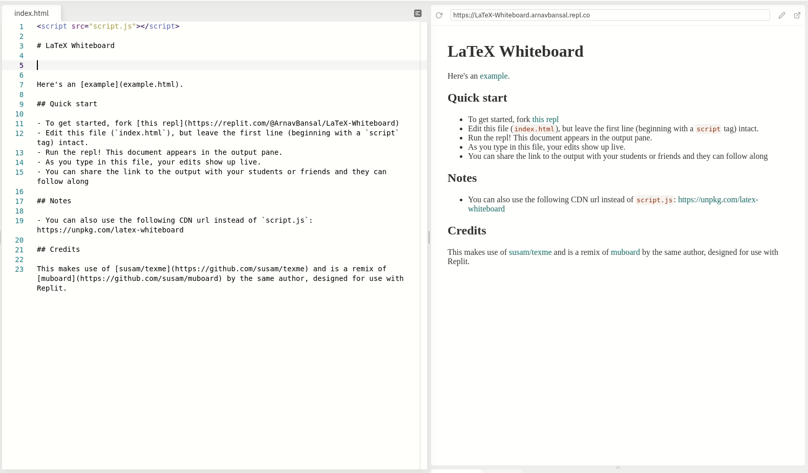

# LaTeX Whiteboard

A tool for creating markdown-enabled LaTeX boards that are easy to share and update live.

Here's an [example](https://latex-whiteboard.arnavbansal.repl.co/example.html) with LaTeX

## Quick start

- To get started, fork [this repl](https://replit.com/@ArnavBansal/LaTeX-Whiteboard)
- Edit this file (`index.html`), but leave the first line (beginning with a `script` tag) intact.
- Run the repl! This document appears in the output pane.
- As you type in this file, your edits show up live.
- You can share the link to the output with your students or friends and they can follow along

## Notes

- You can also use the following CDN url instead of `script.js`: https://unpkg.com/latex-whiteboard

## Credits

This makes use of [susam/texme](https://github.com/susam/texme) and is a remix of [muboard](https://github.com/susam/muboard) by the same author, designed for use with Replit.